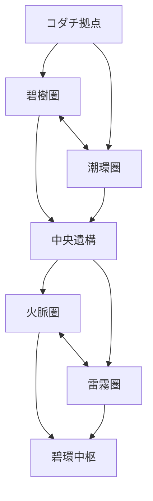

# Claude Codeへの依頼書：物語・世界・マップ・進行構造の刷新

## あなたの役割

あなたはシニアゲームデザイナー兼JavaScriptエンジニアです。
このリポジトリを、短時間で終わる直線的な模倣作品から、探索・選択・再訪に意味がある独自のモンスター共生RPGへ刷新してください。

提案だけで終わらず、既存コードを調査し、設計、実装、検証、README更新まで完了してください。

## 現在地

- ビルド不要のHTML/CSS/JavaScript製ブラウザゲーム
- `data.js`に種族、技、マップ、NPC、トレーナーを定義
- `game.js`に移動、イベント、進行、セーブを実装
- `battle.js`にターン制戦闘を実装
- `monster-art.js`で28種を32×32の骨格別イラストへ刷新済み
- `monster-art.js`を旧ランダム毛玉生成へ戻さないこと

## 現状の重大な問題

1. 8都市が同じ`CITY_ROWS`を共有し、色と名称しか違わない
2. 8ジムが同じ`GYM_ROWS`を共有している
3. ルート2・5・7、ルート4・6・8が同一レイアウト
4. 世界が一本の鎖で、分岐、循環、近道、任意探索がない
5. ミナモシティの通行止めNPCを迂回できる
6. ヴィクトリーロード進入条件が全バッジではなく`badge8`だけ
7. 後半地域へ先行し、高レベル個体を捕獲して本編を短縮できる
8. 各ジムが一般トレーナー1人＋リーダー戦だけで、攻略性がない
9. 捕獲した7体目以降が`box`へ入るが、取り出すUIがない
10. READMEや設定が既存の有名作品へ寄り過ぎており、独自性が弱い

## 刷新後の作品コンセプト

仮題は「ポケットレジェンド 碧環の旅」。

セイリュウ地方では、自然エネルギーを循環させる古代装置「碧環」が弱まり、森林の枯死、河川の逆流、火山灰、雷霧が同時発生している。

主人公は博士から選ばれた特別な少年ではなく、地域の異変を記録する若い巡環士候補。モンスターを倒して支配するのではなく、各地の守護獣と信頼を築き、失われた4つの環核を再接続する。

対立者レンは単純な悪役ライバルではない。「人が装置を制御すべき」という合理主義者で、主人公の「生態系に選択を委ねる」方針と対立する。

敵対組織はモンスターを盗むだけの集団にしない。災害を止めるため碧環を強制起動しようとする復旧技術者集団「灰星局」とし、目的には正当性があるが、手段が生態系を破壊する構図にする。

最終判断では、碧環を完全復旧する、自然循環へ戻す、人とモンスターによる分散管理へ移行する、の3方針をプレイヤーの行動履歴から提示する。

既存の有名モンスター収集作品の固有用語、台詞、展開、UI、組織構造を直接模倣しないこと。

## 世界構造

一本道を廃止し、中央拠点から複数地域を選択できる構造にする。



### 地域1：碧樹圏

- 樹上集落ハナゾノ
- 苔むす獣道
- 倒木で塞がれた旧街道
- 花粉の湿地
- 守護獣の森殿
- 炎系モンスターの能力で倒木を処理し、近道を開通

### 地域2：潮環圏

- 水路都市ミナモ
- 干潮時だけ通れる浅瀬
- 水門管理区
- 沈んだ観測所
- 水系モンスターの能力で水位を操作

### 地域3：火脈圏

- 鍛冶都市ヒバナ
- 灰の段丘
- 冷却洞
- 廃炉坑道
- 岩系または水系能力で異なる攻略ルートを選択

### 地域4：雷霧圏

- 高地都市ライデン
- 風車丘陵
- 帯電洞窟
- 雲上観測塔
- 飛行系能力で崖を越え、電気系能力で装置を復旧

### 最終地域

- 中央遺構が4つの環核に応じて段階変化
- 全環核だけでなく、レンとの対話、灰星局の救助、地域サブクエストの結果を終盤へ反映
- 最終戦だけでなく、選択と探索結果により結末を変える

## マップ実装要件

1. 全都市、全屋外ルート、全ダンジョンを固有配列として定義する
2. 同じ`rows`配列を別地域で使い回さない
3. 各屋外マップに最低2つの分岐、1つの循環路、1つの任意エリアを設ける
4. 各地域にランドマークを置き、木と草を並べただけの地形にしない
5. 一方通行の段差、開通する橋、解除可能な障害、拠点への近道を実装する
6. 能力ゲートは特定種族の所持を強制せず、タイプまたは複数解決手段で判定する
7. マップ移動条件をNPCの立ち位置に依存させない
8. 出入口ごとに`requirements`を持たせ、条件判定を共通関数化する

例：

```js
requirements: {
  allFlags: ['coreForest', 'coreTide'],
  anyAbilities: ['breakRock', 'lowerWater'],
  minPartyLevel: 18
}
```

`badge8`だけを見るような個別条件分岐を廃止し、条件の意味とエラーメッセージをデータ側へ置くこと。

## 探索と再訪

- 最初は通れないが、能力取得後に開く場所を各地域2か所以上用意
- 開通した橋や水門はセーブデータに永続化
- サブクエストを最低8件実装
- サブクエストは「話すだけ」「戦うだけ」にせず、追跡、選択、収集、救助、環境変化を混ぜる
- 地域の問題解決後、NPC配置、台詞、遭遇種、BGMまたはタイルを変化させる
- クリア後は守護獣再戦、未解決クエスト、環境変化後の希少種探索を可能にする

## 試練の刷新

8つの同型ジムは廃止し、4地域の「環核試練」へ統合する。戦闘数を減らすのではなく、地域探索と仕掛けを試練に含める。

- 碧樹：光の差す順に樹路を開く
- 潮環：水位を3段階で切り替え経路を作る
- 火脈：熱量を管理しながら冷却路を確保する
- 雷霧：送電経路を組み替えて観測塔を起動する

各試練は固有マップ、固有ルール、固有演出を持つこと。ボス戦前に同じ四角い部屋を歩くだけの構造は禁止。

## 進行とバランス

- 碧樹圏と潮環圏は好きな順で攻略可能
- 2環核取得で中央遺構が開く
- 火脈圏と雷霧圏も好きな順で攻略可能
- 4環核と必要ストーリーフラグが揃うまで最終地域へ入れない
- 進行順が変わっても敵レベルを地域進行度に応じて調整する
- 高レベル個体を捕獲しただけで全工程を飛ばせない仕組みにする
- 敗北時の所持金半減は過剰なので、固定額または難易度別に見直す

## UI・機能面

- モンスターセンターへボックス端末を追加
- 手持ちとボックス間の入れ替え、一覧、詳細確認を実装
- 現在の主目標と任意目標を確認できる旅記録を追加
- マップ画面に発見済み地点、未開通経路、現在地を表示
- スマホでは固定520px画面の単純縮小だけに依存せず、操作ボタンの最小タップ領域を44px以上確保

## オフライン・品質要件

- Google Fontsへの外部接続を削除し、システムフォントまたは同梱フォントを使用
- ネットワークなしで全機能が動作すること
- セーブデータをバージョン2へ移行し、旧バージョン1から安全にマイグレーションすること
- 不正または壊れたセーブデータで起動不能にならないこと
- マップ定義の検証関数またはテストスクリプトを追加すること

検証項目：

- 出入口の接続先が存在する
- 出入口の往復座標が歩行可能
- 必須目標が条件未達で通過できない
- 必須目標達成後は必ず通過できる
- 主人公が壁内やマップ外へ配置されない
- 全必須地点が開始地点から到達可能
- 同じ`rows`オブジェクトを複数の主要マップが共有していない

## 完了条件

- 4地域＋中央遺構＋最終地域が実際に遊べる
- メインストーリー開始からエンディングまで進行できる
- 最終地域への早期侵入ができない
- 主要マップのコピーがない
- 各地域に分岐、循環、任意探索、再訪要素がある
- 8件以上のサブクエストが動作する
- ボックスからモンスターを出し入れできる
- 完全オフラインで起動できる
- 既存セーブを壊さず移行できる
- READMEに新しい物語、操作、世界構造、セーブ仕様を記載する
- 変更ファイル一覧、確認手順、残課題を最終報告に記載する

## 実装順序

1. 現行コードの依存関係と進行フラグを調査
2. 新しい世界グラフとストーリーフラグを設計
3. セーブデータv2と条件判定を実装
4. 固有マップを1地域ずつ実装・検証
5. 試練、サブクエスト、地域変化を実装
6. ボックス、旅記録、マップUIを実装
7. 最終地域と分岐エンディングを実装
8. オフライン化、回帰確認、README更新

一度に全ファイルを書き換えず、各段階で構文確認と手動確認を行ってください。既存の戦闘、音楽、32×32キャラクター描画が壊れていないことも毎段階で確認してください。
